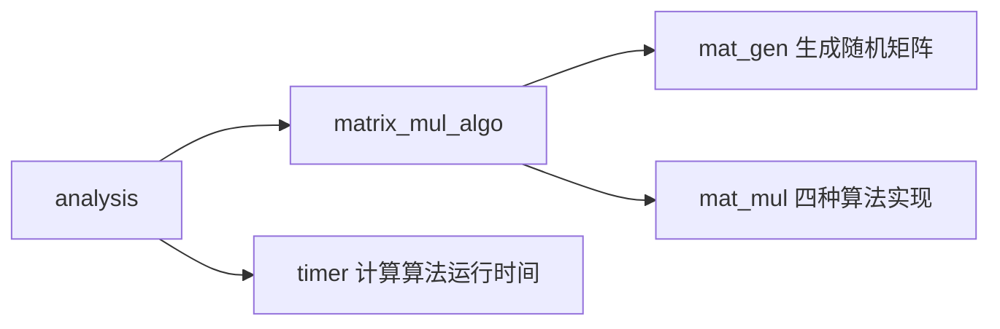

# 基于CUDA的矩阵乘法算法加速 - Python 实现

> 王超  |  201721010308

##1. 项目简介

对于 CUDA 程序开发大家的首选为 C++，但目前 Python 环境下数值计算需求日益凸显，另一方面 Nvidia 官方也支持 Python 环境下 的 Numba 项目，使得在 Python 环境下使用 CUDA 进行加速变为可能。

Numba 最大限度地将 Nvidia 提供的 C 环境下的 CUDA API 封装为 Python API，目前（0.34.0版本）除了少数高级功能还未支持，对于绝大多数 CUDA 模型中定义的 API 都有良好的接口。同时借助于 Python 简洁直观的特点以及 Numba 对 Numpy （目前机器学习的必备包）的原生支持，使得 Python 环境下的 CUDA 编程变得十分简单，具有代码简洁，可读性强的优点。

## 2. 加速算法

###2.1 算法的输入与输出

考虑到编码，存储和边界条件的影响，本文对矩阵乘法算法的分析基于以下的设定：

1. 所有参与计算的矩阵均为实方阵，且在GPU端计算的矩阵规模小于 1024*1024；
2. 矩阵中所有元素存储为32位单精度浮点数，并随机初始化；
3. 由于输入的随机性，分析过程中每种算法每个输入规模重复100次，计算运行的平均时间和加速比；
4. 分析过程统计算法的计算时间，对GPU端执行算法的还要统计算法对数据的读取与输出时间。

###2.2 CPU端矩阵乘法的简单实现

对实矩阵 $A \in R^{m\times p} B \in R^{p \times n}$ ，考虑矩阵乘法的基本公式：
$$
c_{ij} = \sum_{k=i}^pa_{ik}b_{kj}
$$
则可使用三个 for-loop 实现该算法：

1. 首先获取 A 行，列和 B 列的维度；
2. 对 A 的行，B 的列遍历，对 A, B 中对应行列的元素相乘相加得到 C 的元素；

易知该算法的时间复杂度为 $O(n^3)$ ，若不经过优化地在CPU上单线程执行，当 $n$ 很大时的时间开销是很大的。

注：

1. 本文的所有算法都在 Python 环境下实现，且为了数据表示的方便使用了Python 环境下数值计算常用的包 Numpy，但没有使用 Numpy 定义的乘法算法，只使用 Numpy 定义的数据结构。
2. 若使用 Numpy 定义的乘法算法，由于实现将代码直接编译为优化过的机器码执行，而不经过一般 Python 程序解释器的过程，那么算法将会得到远超 Python 能力的性能提升，在小规模输入下甚至会超过 CUDA 的加速效果。

###2.3 CPU端算法优化

通过对 2.2 中基本算法的数学优化，矩阵乘法的算法复杂度目前可以优化到 $O(n^{2.376})$ 。但在 Python 环境中还有更加高效的优化方案。

由于 Python 程序解释执行的特性，在 CPU 运行同样的算法，未经过优化的Python 代码很大程度上会比 C/C++ 等编译执行的代码慢。

借鉴上面的思路可知，如果能将我们算法中的一些代码直接通过特殊的编译器编译为机器码，那么算法的性能也许会有成倍的提升。这一点在 Python 中已经有了很好的方案（Just-in-Time complier，JIT编译器），而我所使用的 numba 包也提供了这样的编译器，故在直接在 2.2 提供的算法的基础上编译执行即可。

为了方便与 2.2 进行性能比较，两种算法都只使用单线程执行。

###2.4 GPU端矩阵乘法的简单实现


CUDA 程序在 CPU（Host）端调用，在GPU（Device）端执行。作为矩阵乘法的一个 CUDA 简单实现，我直接将 2.2 中的乘法算法搬移到 GPU 上执行。这样的实现直接了当且非常的直观，但是算法效率很低，因为矩阵中有大量的元素被程序从显存中重复加载，在 GPU 的三级存储体系（显存，共享内存和寄存器）中，显存是最慢的。

为了编码方便和控制边界条件，我使用 每个 block 的线程数和每个 grid 的 block 数来确定矩阵的规模（而不是用固定的矩阵大小来计算前者，这样可能会引入 Control Divergence）。在算法调用时，直接在外部定义好需要的 thread_per_block 和 block_per_grid。在算法执行时，使用初始化的 grid 方案来计算每个线程的位置和工作即可。

算法过程如下：

1. 将算法从 host 传到 device，并定义好需要用到的 thread 和 block；
2. 在 device 端计算；
3. 将结果从 host 传回 device。

###2.5 GPU端算法优化

由 2.4 的分析可知，如果能减少 device 上代码对显存中数据的访问次数那么算法效率应该会得到很大的提升。

基于 CUDA 提供的 shared memory 可以设计如下的基于 block 和 shared memory 的优化算法。

1. 提前将数据根据 block size 和算法计算中矩阵字块的位置提交到对应的 shared memoy 中；
2. 对于同一个 block 中的线程（一组线程），使它们访问同一个 shared memory 中的数据，完成各自的计算任务；
3. 各组内每个 thread 完成计算后同步结果，确保每个循环内不会在 shared memory 内出现重复修改的问题；
4. 计算完成后将结果 copy 到 Host端，输出。

由于 shared memory 是一种有限的资源，算法在载入数据之前预先定义了 16 的线程容量。

## 3. 加速实验方案

###3.1 方案设计

由于算法性能分析涉及到很多的因素，针对本文提出的四种算法，我使用控制变量的原则设计了4类简单的算法性能分析方案，具体方案如下：

**1. CPU端原始算法与优化算法性能比较**

针对同样的随机输入，考察不同规模输入对CPU端算法优化效果的影响，分别记录使用使用编译优化的单线程算法和多线程算法的运行时间，计算其与CPU原始算法间的加速比。

**2. CPU端与GPU端运行时间分析**

针对同样的随机输入，考察不同TPB与BPG的组合对GPU端算法优化效果的影响，记录算法的运行时间，计算其与CPU原始算法间的加速比。

**3. GPU端算法优化效果分析**

针对同样的随机输入，考察不同TPB与BPG的组合对GPU端算法优化效果的影响，记录算法的运行时间，计算其与CPU原始算法间的加速比。

这里需要注意，初始化时定义的 TPB 与算法中用于 shared memory 的 TPB 应保持一致。

**4. 四种算法加速效果横向比较**

针对同样的随机输入，先后运行四种算法，考察其相对于 CPU 原始算法的加速比。

###3.2 测试指标

## 4. 加速性能分析

4.1 -4.3 表中表头及单位定义如下：

| 表头     | 描述            | 单位   |
| ------ | ------------- | ---- |
| TPB    | 每block的线程数    | NA   |
| BPG    | 每grid的block数  | NA   |
| 矩阵大小   | 每个矩阵的行数或列数    | NA   |
| XXXX算法 | 指的是该算法的运行时间   | 秒    |
| 加速比    | 指左列算法除以右列算法的值 |      |

###4.1 CPU 端原始算法与优化算法性能比较

| TPB  | BPG  |  矩阵大小   |   CPU原始算法 |   CPU编译优化 |  加速比 |
| :--: | :--: | :-----: | --------: | --------: | ---: |
|  8   |  4   |   32    |  0.011617 |  0.078501 | 0.15 |
|  8   |  8   |   64    |  0.092322 |  0.120067 | 0.77 |
|  16  |  8   |   128   |  0.732748 |  0.425848 | 1.72 |
|  16  |  16  |   256   |  5.876176 |  2.554025 | 2.30 |
|  32  |  16  | **512** | 46.851184 | 19.352242 | 2.40 |
|  32  |  32  |  1024   |   大于 5 分钟 |     大于5分钟 |   NA |

| TPB  | BPG  | 矩阵大小 |   CPU原始算法 | CPU多线程优化 |       加速比 |
| :--: | :--: | :--: | --------: | -------: | --------: |
|  8   |  4   |  32  |  0.011733 | 0.098283 |      0.12 |
|  8   |  8   |  64  |  0.097628 | 0.098275 |      0.99 |
|  16  |  8   | 128  |  0.734992 | 0.099645 |      7.38 |
|  16  |  16  | 256  |  5.854263 | 0.114840 |     50.98 |
|  32  |  16  | 512  | 473931593 | 0.329386 |    145.52 |
|  32  |  32  | 1024 |   大于 5 分钟 | 1.606029 | $ \infty$ |

###4.2 CPU 端与 GPU 端运行时间分析

| TPB  | BPG  | 矩阵大小 |     CPU算法 |    GPU算法 |    加速比 |
| :--: | :--: | :--: | --------: | -------: | -----: |
|  8   |  4   |  32  |  0.011723 | 0.062875 |   0.19 |
|  8   |  8   |  64  |  0.093027 | 0.063313 |   1.47 |
|  16  |  8   | 128  |  0.736311 | 0.065641 |  11.22 |
|  16  |  16  | 256  |  5.824826 | 1.065528 |  88.89 |
|  32  |  16  | 512  | 47.925247 | 0.105958 | 452.30 |

###4.3 GPU 端算法优化效果分析 

| TPB  | BPG  |  矩阵大小   |   CPU原始算法 |  GPU优化算法 |     加速比 |
| :--: | :--: | :-----: | --------: | -------: | ------: |
|  8   |  4   |   32    |  0.011502 | 0.000494 |   23.28 |
|  8   |  8   |   64    |  0.090201 | 0.000500 |  180.40 |
|  8   |  16  |   128   |  0.714943 | 0.000604 | 1183.68 |
|  16  |  16  |   256   |  5.749575 | 0.001629 | 3529.51 |
|  32  |  16  | **512** | 46.768621 | 0.008688 | 5383.13 |

### 4.4 四种算法加速效果横向比较

下表中只记录各个算法的加速比，CPU原始算法记为 1 。

| 矩阵大小 | CPU原始算法 | CPU多线程优化算法 | GPU原始算法 | GPU优化算法 |
| :--: | :-----: | :--------: | :-----: | :-----: |
|  32  |    1    |    0.15    |  0.19   |   23    |
|  64  |    1    |    0.94    |  1.46   | 184.43  |
| 128  |    1    |    7.48    |  11.69  | 1137.30 |
| 256  |    1    |   51.31    |  88.42  | 3679.02 |
| 512  |    1    |   146.21   | 488.49  | 5430.48 |

## 5. 结论

分析 上面各表的数据，可以得到如下的结论：

1. 由于CPU原始算法具有指数的复杂度，故当输入超过一定规模后（试验中为1024*1024），计算时间就变得很长了，不能通过上一次的时间（512\*512)来推算目前的时间开销，也从侧面展示了指数复杂度的问题；
2. CPU编译优化对于Python实现的算法具有一定的加速作用，但是就实验的输入规模而言效果不明显，对于过大的输入规模也变得难以计算；
3. CPU多线程优化对与算法有较大提升，启发我们对于小规模的输入可以不使用CUDA加速；
4. CUDA加速效果好于CPU多线程加速，且随着输入规模的增加而增加；
5. 使用 shared memory 优化之后可以发现算法的执行时间显著减少了，我推断是访问数据的延迟大幅降低从而得到了这样显著的效果。

CUDA程序的优化远不止于使用 shared memory 这一种手段，针对具体的问题可以综合地使用CUDA抽象出来的硬件特性加以优化。

##参考文献

1. CUDA C Programming Guide https://docs.nvidia.com/cuda/cuda-c-programming-guide/
2. numba http://numba.pydata.org/numba-doc/latest/index.html
3. numpy https://docs.scipy.org/doc/

##附录：

###附录1 项目核心代码

**文件结构**



**mat_gen.py 生成指定大小的随机矩阵**

```python
import numpy as np


def gene_matrix(row, col, rand=True, show=False):
    """
    func: 给出矩阵的行和列大小，输出指定类型的矩阵并初始化
    args: rand 对矩阵随机初始化，否则初始化为零矩阵
          show 输出矩阵信息，用于 DEBUG
    """
    if rand:
        matrix = np.array(np.random.random((row, col)), dtype=np.float32)
    else:
        matrix = np.array(np.zeros((row, col)), dtype=np.float32)

    if show:
        print(matrix)

    return matrix

```

**mat_mul.py 定义矩阵乘法的六种算法（使用了四种）**

```python
"""
# this file defined 6 types of matrix multiple implement, in practice
# only use 4 of them.
"""
from numba import cuda, jit, float32


def matmul(A, B, C):
    """
    host: cpu with 1 thread.
    func: use naive element-wise mul cal the result.
    """
    m, p = A.shape
    n = B.shape[1]
    for i in range(0, m):
        for j in range(0, n):
            for k in range(0, p):
                C[i, j] += A[i, k] * B[k, j]


@cuda.jit
def faster_matmul(A, B, C):
    """
    host: cpu with 1 thread, compile optimise.
    func: use naive element-wise mul cal the result.
    """
    m, p = A.shape
    n = B.shape[1]
    for i in range(0, m):
        for j in range(0, n):
            for k in range(0, p):
                C[i, j] += A[i, k] * B[k, j]


@jit(nogil=True, parallel=True)
def faster_matmul_parallel(A, B, C):
    """
    host: cpu with 6 thread, compile optimise.
    func: use naive element-wise mul cal the result.
    """
    m, p = A.shape
    n = B.shape[1]
    for i in range(0, m):
        for j in range(0, n):
            for k in range(0, p):
                C[i, j] += A[i, k] * B[k, j]


@cuda.jit
def cuda_matmul(A, B, C):
    """
    host: gpu
    func: Perform square matrix multiplication of C = A * B
    """
    i, j = cuda.grid(2)
    if i < C.shape[0] and j < C.shape[1]:
        tmp = 0.
        for k in range(A.shape[1]):
            tmp += A[i, k] * B[k, j]
            C[i, j] = tmp


@cuda.jit
def cuda_matmul_2(A, B, C):
    """
    host: gpu
    func: each thread cal a result in C[i,j] with element-wise mul.
    """
    # get the local thread, block and grid index
    tx = cuda.threadIdx.x
    ty = cuda.threadIdx.y
    bx = cuda.blockIdx.x
    by = cuda.blockIdx.y
    bw = cuda.blockDim.x
    bh = cuda.blockDim.y

    # get the global index for thread
    x = tx + bx * bw
    y = ty + by * bh

    # cal the size of square matrix
    row, col = A.shape
    mat_size = row * col

    # check the block boundary
    if x >= mat_size or y >= mat_size:
        return

    for i in range(mat_size):
        C[y, x] += A[y, i] * B[i, x]


@cuda.jit('(float32[:,:], float32[:,:], float32[:,:])')
def faster_cuda_matmul(A, B, C):
    """
    host: gpu
    func: use the share memory to accelerate the speed.
    detail: Controls threads per block and shared memory usage.
            The computation will be done on blocks of TPBxTPB elements.
            Define an array in the shared memory
            The size and type of the arrays must be known at compile time
    """
    # define: thread_per_block, when modified in analysis, you must modify this TPB
    TPB = 16
    sA = cuda.shared.array(shape=(TPB, TPB), dtype=float32)
    sB = cuda.shared.array(shape=(TPB, TPB), dtype=float32)

    # get the global thread index
    x, y = cuda.grid(2)

    tx = cuda.threadIdx.x
    ty = cuda.threadIdx.y

    # block per grid
    bpg = cuda.gridDim.x

    if x >= C.shape[0] and y >= C.shape[1]:
        # quit if (x, y) is outside of valid C boundary
        return

    # Each thread computes one element in the result matrix.
    # The dot product is chunked into dot products of TPB-long vectors.
    tmp = 0.
    for i in range(bpg):
        # Preload data into shared memory
        sA[tx, ty] = A[x, ty + i * TPB]
        sB[tx, ty] = B[tx + i * TPB, y]

        # Wait until all threads finish preloading
        cuda.syncthreads()

        # Computes partial product on the shared memory
        for j in range(TPB):
            tmp += sA[tx, j] * sB[j, ty]

        # Wait until all threads finish computing
        cuda.syncthreads()
        C[x, y] = tmp
    
```

**timer.py 定义计时器类和计时方法**

```python
import time as t


class timer:
    """
    class:  定义时间，用于计时
    param: 开始时间，结束时间
    func : __init__ 初始化时间类
           start 开始计时
           stop 结束计时
           __calc_lasted_time 计算持续时间

    """
    def __init__(self):
        self.start_time = 0
        self.stop_time = 0
        self.lasted = 0

    # 计时开始
    def start(self):
        self.start_time = t.time()

    # 计时结束
    def stop(self):
        self.stop_time = t.time()
        return self.__calc_lasted_time()

    # 计算持续时间，内部方法
    def __calc_lasted_time(self):
        self.lasted = round(self.stop_time - self.start_time, 6)
        self.prompt = "time cost: "
        self.prompt = self.prompt + str(self.lasted) + 's'
        # print(self.prompt)
        return self.lasted
 
```

**analysis.py 调用各个模块执行**

```python
"""
# for analysis propose, i designed all four algorithms running in the same RAM / GPU memory space.
# for the memory limit and i can't find the right way to release the GPU-memory in the document, so
# i need to choose the matrix size to a small scale.
"""
from numba import cuda
from mat_gen import gene_matrix
from mat_mul import matmul, faster_matmul, faster_matmul_parallel, cuda_matmul, faster_cuda_matmul
from timer import timer as t
import numpy as np


thread_per_block = 16
block_per_grid = 32

if __name__ == "__main__":

    mat_size = block_per_grid * thread_per_block

    # init matrix
    A = gene_matrix(mat_size, mat_size, rand=True, show=False)
    B = gene_matrix(mat_size, mat_size, rand=True, show=False)
    C_1 = gene_matrix(mat_size, mat_size, rand=False, show=False)
    C_2 = gene_matrix(mat_size, mat_size, rand=False, show=False)
    C_3 = gene_matrix(mat_size, mat_size, rand=False, show=False)
    C_4 = gene_matrix(mat_size, mat_size, rand=False, show=False)

    print("matrix size : %d x %d" % (mat_size, mat_size))

    # init timer
    cpu_timer = t()
    faster_cpu_timer = t()
    gpu_timer = t()
    faster_gpu_timer = t()

    # CPU compute
    cpu_timer.start()
    matmul(A, B, C_1)
    t_cpu = cpu_timer.stop()

    # faster CPU compute
    faster_cpu_timer.start()
    faster_matmul_parallel(A, B, C_2)
    t_faster_cpu = faster_cpu_timer.stop()

    # GPU compute
    gpu_timer.start()
    stream = cuda.stream()
    with stream.auto_synchronize():
        # 将数据传入GPU
        dA = cuda.to_device(A, stream)
        dB = cuda.to_device(B, stream)
        dC_3 = cuda.to_device(C_3, stream)
        cuda_matmul[(block_per_grid, block_per_grid), (thread_per_block, thread_per_block), stream](dA, dB, dC_3)
        # 将结果取回CPU
        dC_3.to_host(stream)
    t_gpu = gpu_timer.stop()

    # faster GPU compute
    faster_gpu_timer.start()
    stream = cuda.stream()
    with stream.auto_synchronize():
        # 将数据传入GPU
        dA = cuda.to_device(A, stream)
        dB = cuda.to_device(B, stream)
        dC_4 = cuda.to_device(C_4, stream)
        faster_cuda_matmul[(block_per_grid, block_per_grid), (thread_per_block, thread_per_block), stream](dA, dB, dC_4)
        # 将结果取回CPU
        dC_4.to_host(stream)
    t_faster_gpu = faster_gpu_timer.stop()

    # Check result
    assert np.allclose(C_1, C_4)

    # output the result and cal the speedup over default cpu method.
    result = '''
        default cpu mul: {:f} s, speedup: {:.2f}x,
        faster  cpu mul: {:f} s, speedup: {:.2f}x,
        default gpu mul: {:f} s, speedup: {:.2f}x,
        faster  gpu mul: {:f} s, speedup: {:.2f}x,
    
    '''.format(
        t_cpu, t_cpu / t_cpu,
        t_faster_cpu, t_cpu / t_faster_cpu,
        t_gpu, t_cpu / t_gpu,
        t_faster_gpu, t_cpu / t_faster_gpu,
    )
    print(result)

```

###附录 2 测试环境

|   硬件   |           参数           |
| :----: | :--------------------: |
|  CPU   | i5-8600k, 3.6-4.3Ghz*6 |
|  GPU   |      GTX1060, 6GB      |
|  RAM   |   DDR4, 2400Mhz, 8GB   |
| Python |         3.6.0          |
| numba  |         0.37.0         |
|  CUDA  |          9.0           |

> 注意：在 Python 环境下希望通过 Numba 使用 CUDA 编程，必须安装 CUDAtoolkit，否则只能使用编译优化功能。